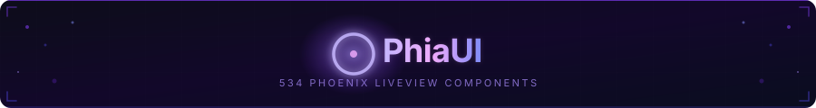

<p align="center">
  
</p>

# PhiaUI

**534 production-ready Phoenix LiveView components — the most complete UI library in the Elixir ecosystem.**

PhiaUI is a copy-paste component library for Phoenix LiveView, inspired by shadcn/ui. Every component is ejected directly into your project — you own the code, customise freely, and never fight an abstraction layer. Built on TailwindCSS v4 semantic tokens with full WAI-ARIA accessibility, zero heavy npm dependencies, and first-class dark mode.

[](https://hex.pm/packages/phia_ui)
[](https://elixir-lang.org)
[](https://hex.pm/packages/phoenix_live_view)
[](LICENSE)
[](https://github.com/phiaui/phia_ui/tree/main/test)

---

## Why PhiaUI?

| Feature | **PhiaUI** | [Salad UI](https://github.com/bluzky/salad_ui) | [Mishka Chelekom](https://mishka.tools/chelekom) | [Doggo](https://github.com/woylie/doggo) | [Primer Live](https://github.com/ArthurClemens/primer_live) | [shadcn/ui](https://ui.shadcn.com) |
|---|:---:|:---:|:---:|:---:|:---:|:---:|
| **Platform** | Phoenix LiveView | Phoenix LiveView | Phoenix LiveView | Phoenix LiveView | Phoenix LiveView | React |
| **Components** | **534** | ~40 | ~100 | ~40 | ~45 | ~50 |
| Copy-paste ownership | ✅ | ✅ | ✅ | ✅ | ❌ | ✅ |
| LiveView-native (`phx-*`, streams) | ✅ | ✅ | ✅ | ✅ | ✅ | ❌ |
| Zero npm runtime deps | ✅ | ✅ | ✅ | ✅ | Partial | ❌ |
| Full WAI-ARIA on all interactive | ✅ | Partial | Partial | ✅ | Partial | ✅ |
| TailwindCSS v4 | ✅ | Partial | ✅ | ❌ | ❌ | Partial |
| Dark mode | ✅ | ✅ | ✅ | ✅ | ✅ | ✅ |
| Calendar & date/time suite | ✅ (33) | ❌ | Partial | ❌ | ❌ | Partial |
| Charts (SVG, zero-JS) | ✅ (16 types) | ❌ | ❌ | ❌ | ❌ | ❌ |
| Data Grid (sorting, pinning, export) | ✅ | ❌ | ❌ | ❌ | ❌ | ❌ |
| Drag & Drop | ✅ | ❌ | ❌ | ❌ | ❌ | ❌ |
| Rich text / code editors | ✅ | ❌ | ❌ | ❌ | ❌ | ❌ |
| Background patterns & animations | ✅ (37) | ❌ | ❌ | ❌ | ❌ | Partial |
| Ecto `FormField` auto-integration | ✅ | Partial | ✅ | ✅ | ✅ | N/A |
| LiveBook tutorial | ✅ | ❌ | ❌ | ❌ | ❌ | N/A |

---

## Quick Start

### 1. Add dependency

```elixir
# mix.exs
def deps do
  [
    {:phia_ui, "~> 0.1.11"}
  ]
end
```

```bash
mix deps.get
```

### 2. Install assets

```bash
mix phia.install
```

This copies all component `.ex` files into `lib/your_app_web/components/ui/`, JS hooks into `assets/js/phia_hooks/`, and the CSS theme into `assets/css/`.

### 3. Configure CSS

In `assets/css/app.css`:

```css
@import "../../deps/phia_ui/priv/static/theme.css";
```

In `assets/js/app.js`, register hooks:

```javascript
import { PhiaHooks } from "./phia_hooks"

let liveSocket = new LiveSocket("/live", Socket, {
  hooks: { ...PhiaHooks, ...YourHooks }
})
```

### 4. Use components

Import in your LiveView or layout module and start rendering:

```elixir
defmodule MyAppWeb.PageLive do
  use MyAppWeb, :live_view
  import PhiaUi.Components.Buttons
  import PhiaUi.Components.Feedback
  import PhiaUi.Components.Inputs
end
```

```heex
<.button variant="default" phx-click="save">Save changes</.button>
<.alert variant="success">Saved successfully!</.alert>
<.input type="text" name="email" label="Email" placeholder="you@example.com" />
```

---

## Component Catalog

534 components across 18 categories. Click any category for full API docs and examples.

| Category | Components | Description |
|---|:---:|---|
| [**Animation**](docs/components/animation.md) | 22 | Marquee, typewriter, particles, text effects, motion primitives |
| [**Background**](docs/components/background.md) | 15 | Mesh gradients, noise, dot grids, bokeh, animated patterns |
| [**Buttons**](docs/components/buttons.md) | ~20 | Button, toggle, split, icon, social, fancy, action buttons |
| [**Calendar**](docs/components/calendar.md) | 33 | Full date/time suite — pickers, schedulers, booking, streaks |
| [**Cards**](docs/components/cards.md) | 22 | Stat, article, profile, pricing, product, receipt, event cards |
| [**Data**](docs/components/data.md) | ~80 | Charts (16 types), tables (9 types), data grid, trees, Kanban |
| [**Display**](docs/components/display.md) | 27 | Icons, badges, avatars, timeline, utilities, dark mode |
| [**Editor**](docs/components/editor.md) | 19 | Toolbar, bubble menu, markdown editor, advanced rich-text editor |
| [**Feedback**](docs/components/feedback.md) | 20 | Alerts, banners, toasts, loading, skeletons, empty states |
| [**Forms**](docs/components/forms.md) | 34 | Form layout, fieldsets, checkboxes, radio cards, cascaders |
| [**Inputs**](docs/components/inputs.md) | 61 | Every input type — text, rich, OTP, upload, textarea variants |
| [**Interaction**](docs/components/interaction.md) | 9 | Sortable lists, drag & drop, Kanban, draggable tree |
| [**Layout**](docs/components/layout.md) | 26 | Box, flex, grid, shell, accordion, resizable, scroll area |
| [**Media**](docs/components/media.md) | 5 | Audio player, carousel, image comparison, QR code, watermark |
| [**Navigation**](docs/components/navigation.md) | 33 | Sidebar, topbar, breadcrumb, tabs, command palette, TOC |
| [**Overlay**](docs/components/overlay.md) | 9 | Dialog, drawer, sheet, dropdown, popover, tooltip, context menu |
| [**Surface**](docs/components/surface.md) | 22 | Glass, bento grid, animated borders, spotlight, overlays |
| [**Typography**](docs/components/typography.md) | 18 | Heading, prose, code block, gradient text, diff display |

---

## Usage Examples

### Data table with server-side sorting

```elixir
defmodule MyAppWeb.UsersLive do
  use MyAppWeb, :live_view
  import PhiaUi.Components.Data

  def mount(_params, _session, socket) do
    {:ok, assign(socket, users: list_users(), sort_key: "name", sort_dir: "asc")}
  end

  def handle_event("sort", %{"key" => key, "dir" => dir}, socket) do
    {:noreply, assign(socket, users: sort_users(key, dir), sort_key: key, sort_dir: dir)}
  end
end
```

```heex
<.data_grid id="users-grid" rows={@users} sort_key={@sort_key} sort_dir={@sort_dir}>
  <.data_grid_head sort_key="name" on_sort="sort">Name</.data_grid_head>
  <.data_grid_head sort_key="email" on_sort="sort">Email</.data_grid_head>
  <.data_grid_head sort_key="role" on_sort="sort">Role</.data_grid_head>
  <:row :let={user}>
    <.data_grid_cell><%= user.name %></.data_grid_cell>
    <.data_grid_cell><%= user.email %></.data_grid_cell>
    <.data_grid_cell>
      <.badge variant={role_variant(user.role)}><%= user.role %></.badge>
    </.data_grid_cell>
  </:row>
</.data_grid>
```

### Ecto form with validation

```elixir
defmodule MyAppWeb.ProfileLive do
  use MyAppWeb, :live_view
  import PhiaUi.Components.Inputs
  import PhiaUi.Components.Buttons

  def render(assigns) do
    ~H"""
    <.form for={@form} phx-change="validate" phx-submit="save">
      <.phia_input field={@form[:name]} label="Full name" required />
      <.phia_input field={@form[:email]} type="email" label="Email" />
      <.phia_input field={@form[:bio]} type="textarea" label="Bio" />
      <.button type="submit" variant="default">Save profile</.button>
    </.form>
    """
  end
end
```

### Booking calendar with time slots

```heex
<.booking_calendar
  id="appt-calendar"
  available_dates={@available_dates}
  selected_date={@selected_date}
  on_select="select_date"
/>
<.time_slot_grid
  slots={@slots}
  selected_slot={@selected_slot}
  on_select="select_slot"
/>
```

### Glassmorphism hero section

```heex
<div class="relative min-h-screen overflow-hidden">
  <.animated_gradient_bg from="#667eea" via="#764ba2" to="#f64f59" />
  <.bokeh_bg colors={["#f59e0b", "#6366f1", "#ec4899"]} count={6} />

  <div class="relative z-10 flex items-center justify-center min-h-screen">
    <.glass_card class="p-8 max-w-lg w-full">
      <.heading level={1}>Welcome to MyApp</.heading>
      <.paragraph class="text-muted-foreground mt-2">
        The fastest way to build beautiful UIs.
      </.paragraph>
      <.button variant="default" class="mt-6 w-full">Get started</.button>
    </.glass_card>
  </div>
</div>
```

### Rich text editor

```heex
<.markdown_editor
  id="post-editor"
  name="post[body]"
  value={@post.body}
  toolbar={[:bold, :italic, :link, :code, :heading, :list]}
  phx-change="update_body"
/>
```

---

## Documentation

### Component References

| Page | Contents |
|---|---|
| [Animation](docs/components/animation.md) | All 22 animation primitives with timing and usage |
| [Background](docs/components/background.md) | 15 background pattern components |
| [Buttons](docs/components/buttons.md) | Button variants, groups, fancy buttons, action buttons |
| [Calendar](docs/components/calendar.md) | Full date/time picker and scheduling system |
| [Cards](docs/components/cards.md) | 22 card variants for every use case |
| [Data](docs/components/data.md) | Charts, tables, data grids, trees, Kanban |
| [Display](docs/components/display.md) | Icons, badges, avatars, display utilities |
| [Editor](docs/components/editor.md) | Rich text and markdown editing components |
| [Feedback](docs/components/feedback.md) | Notifications, progress, skeletons, error states |
| [Forms](docs/components/forms.md) | Form structure and advanced selects |
| [Inputs](docs/components/inputs.md) | All 61 input variants with Ecto integration |
| [Interaction](docs/components/interaction.md) | Drag & drop, sortable, Kanban |
| [Layout](docs/components/layout.md) | Page structure, shell, accordion, resizable |
| [Media](docs/components/media.md) | Audio, carousel, image tools, QR |
| [Navigation](docs/components/navigation.md) | Nav patterns, command palette, breadcrumbs |
| [Overlay](docs/components/overlay.md) | Modals, drawers, dropdowns, tooltips |
| [Surface](docs/components/surface.md) | Glass, bento, animated surfaces |
| [Typography](docs/components/typography.md) | Text hierarchy, prose, code |

### Tutorials

| Guide | What you build |
|---|---|
| [LiveBook — Task Manager](docs/guides/tutorial-livebook.md) | Render PhiaUI components interactively in Livebook |
| [Analytics Dashboard](docs/guides/tutorial-dashboard.md) | Sidebar shell + KPI cards + chart + data grid |
| [Booking Platform](docs/guides/tutorial-booking.md) | Multi-step appointment wizard |
| [CMS Editor](docs/guides/tutorial-cms.md) | Article editor with rich text and media upload |

---

## Design System

PhiaUI uses a CSS-first token system built on TailwindCSS v4 `@theme`. Every color, radius, shadow, and animation is expressed as a CSS variable so any theme change propagates instantly.

**Color tokens**: `background`, `foreground`, `card`, `primary`, `secondary`, `muted`, `accent`, `destructive`, `border`, `ring`

**Dark mode**: Class-based — add `.dark` to `<html>`. All components respond automatically.

**Themes**: Run `mix phia.theme install zinc` (or `slate`, `stone`, `gray`, `red`, `rose`, `orange`, `blue`, `green`, `violet`) to switch palettes.

```css
/* Customise in your app.css */
@layer base {
  :root {
    --primary: oklch(0.55 0.24 262);
    --primary-foreground: oklch(0.98 0 0);
    --radius: 0.5rem;
  }
}
```

---

## JS Hooks

PhiaUI ships 81 vanilla-JS hooks. All hooks are registered via `PhiaHooks` in `assets/js/phia_hooks/index.js` after running `mix phia.install`.

Hooks respect `prefers-reduced-motion`, clean up on `destroyed()`, and never require npm packages.

```javascript
// assets/js/app.js
import { PhiaHooks } from "./phia_hooks"

let liveSocket = new LiveSocket("/live", Socket, {
  hooks: { ...PhiaHooks }
})
```

---

## Elixir / Phoenix Requirements

| Requirement | Version |
|---|---|
| Elixir | ≥ 1.17 |
| Phoenix | ≥ 1.7 |
| Phoenix LiveView | ≥ 1.0 |
| TailwindCSS | v4 |
| Node.js (dev only) | ≥ 18 |

---

## Contributing

Contributions are welcome. Please open an issue before submitting a large PR.

```bash
# Clone and set up
git clone https://github.com/your-org/phia_ui
cd phia_ui
mix deps.get
mix test

# Run a specific category
mix test test/phia_ui/components/data/
```

---

## License

MIT © PhiaUI Contributors. See [LICENSE](LICENSE).
